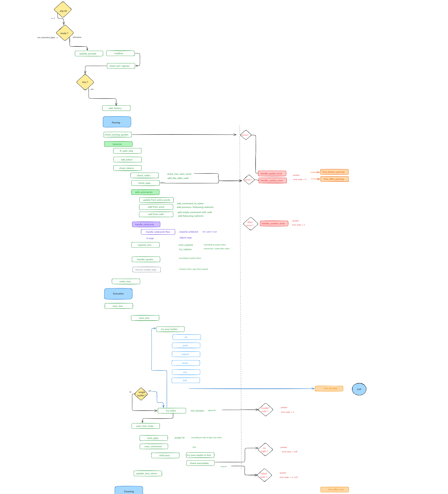

# MiniShell

## Rules

This projects aims at replicating a very basic shell with :
- basic interactive display with history
- interpretation and execution of commands (with name or absolute path)
- interpretation of variables
- interpretation of wildcard `*` for the current directory
- handling of single and double quotes
- handling of redirections and heredoc (`<`, `<<`, `>>`, `>`)
- handling of pipes
- handling of execution status
- handling of EOF and signals SIGINT, SIGQUIT

A few builtin commands with no options were also implemented :
- `cd`
- `pwd`
- `export`
- `unset`
- `env`
`echo` with option n was also implemeted.

